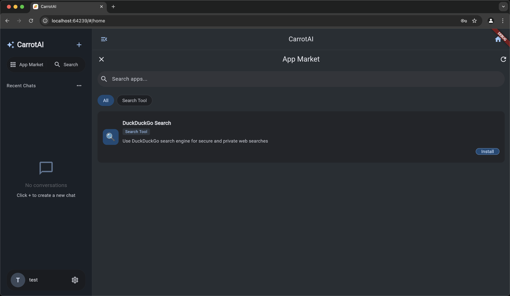

# CarrotAI

<div align="center">
  
  <h3>AI Agent with Multi-Server Streaming & Multi-Language Support</h3>
  <p>Flutter Frontend + FastAPI Backend</p>
</div>

<p align="center">
  🚀 <a href="https://chat.jintongshu.com/">Experience online now</a>  |  <a href="https://jintongshu.com/download/">SaaS Client download</a>
</p>
<p align="center">
  🇨🇳 <a href="README_zh.md">阅读中文文档</a>
</p>

---

## 🥕 Introduction

CarrotAI is a cutting-edge AI agent application that delivers real-time streaming chat via Server-Sent Events (SSE) with built-in Model Control Protocol (MCP) integration. It supports concurrent connections to multiple SSE MCP servers and provides user interfaces in English, Chinese, and Japanese.

## 🚀 Features

- **AI Agent**: Real-time chat powered by SSE and MCP adapters for a seamless conversational experience.
- **Multi-Server Support**: Connect to and call multiple SSE MCP servers simultaneously to aggregate intelligent responses.
- **Multi-Language**: Full localization in English, 中文 (Chinese), and 日本語 (Japanese).
- **Deep Thinking Mode**: Advanced analysis for complex or multi-step queries.
- **Authentication**: Secure login/register flow using JWT tokens.
- **Responsive UI**: Adaptive design for mobile, desktop, and web platforms.
- **Theme Customization**: Light/dark mode, custom seed colors, and dynamic Material 3 theming via `dynamic_color`.
- **File Upload**: Attach and parse files within conversations for richer context.

## 🤖 Supported Model APIs

- **DeepSeek**: Advanced language model with strong reasoning capabilities

## 🛠️ Tech Stack

### Frontend
- **Framework**: Flutter
- **State Management**: Provider
- **UI**: Material Design 3
- **Localization**: flutter gen-l10n
- **Theming**: dynamic_color

### Backend
- **Framework**: FastAPI
- **Streaming**: Server-Sent Events (SSE)
- **AI Integration**: DeepSeek LLM, MCP (Model Control Protocol)
- **Database**: PostgreSQL + SQLAlchemy
- **Authentication**: JSON Web Tokens
- **Migrations**: Alembic
- **Deployment**: Uvicorn & Gunicorn

## 📋 Prerequisites

- Flutter SDK ^3.7.2
- Python >=3.12
- PostgreSQL

## ⚡ Quick Start

> Please make sure that it has been installed. [uv](https://docs.astral.sh/uv/getting-started/installation/)

```bash
# Clone repository
git clone https://github.com/Xingsandesu/CarrotAI.git && cd CarrotAI

# Deal with environment variables
mv backend/.env.example backend/.env && mv .env.example .env

# Edit environment variables
vim .env
vim backend/.env

# Temporarily start PostgreSQL
docker-compose -f docker-compose.yml -f docker-compose.override.yml up -d postgres

# Backend setup
uv run backend/scripts/startup.py --user --email <email> --username <name> --password <password>

# Stop PostgreSQL
docker-compose -f docker-compose.yml -f docker-compose.override.yml down

# Deal with Config
vim config/

# Run Backend
docker compose up -d

```

## 🔧 Installation

### Backend Setup

1. Navigate to the backend directory:
   ```bash
   cd backend
   ```
2. Create and activate a virtual environment:
   ```bash
   uv sync
   ```
3. Copy the example environment file:
   ```bash
   cp .env.example .env
   ```
4. Apply database migrations:
   ```bash
   uv run scripts/init_db.py && uv run scripts/init_config.py
   ```
6. Run the server:
   ```bash
   python main.py       # Development mode
   python main.py prod  # Production mode with Gunicorn
   ```

### Frontend Setup

1. Return to the project root:
   ```bash
   cd ..
   ```
2. Fetch Flutter dependencies:
   ```bash
   flutter pub get
   ```
3. Generate localization files:
   ```bash
   flutter gen-l10n
   ```
4. Launch the app:
   ```bash
   flutter run
   ```
5. Build for web:
   ```bash
   flutter build web --wasm
   ```

## 🌐 Configuration

- **Frontend**: Edit `lib/core/config/app_config.dart` for API endpoints and theming defaults.
- **Backend**: Configure `.env` and `backend/app/core/config.py` for database, and MCP servers.

### Backend Configuration Files

The backend uses JSON files located in `backend/config/` to define models, MCP servers, and custom adapters. Below is the default folder structure:

```text
backend/config/
├── model_configs.json       # LLM model definitions and metadata
├── mcp_servers.json         # SSE MCP server endpoints and env settings
└── app/                     # Custom adapter definitions
    └── duckduckgo-search.json
```

#### model_configs.json

Defines available LLM models for CarrotAI. Each entry includes:
- `id` (string): Unique model identifier.
- `icon` (string): Icon name for display.
- `translations` (object): Localized names and descriptions (`zh`, `en`, `ja`).
- `exclusiveRules` (object): Toggles and exclusion rules for features.

Example:
```json
[
  {
    "id": "deepseek",
    "icon": "smart_toy_outlined",
    "translations": {
      "zh": { "name": "DeepSeek", "description": "专注于深度思考和复杂推理的满血模型" },
      "en": { "name": "DeepSeek", "description": "Powerful Chinese large model focused on deep thinking and complex reasoning" },
      "ja": { "name": "DeepSeek", "description": "深い思考と複雑な推論に特化した強力な中国語大規模モデル" }
    },
    "exclusiveRules": {
      "deepThinking": { "enabled": true, "excludes": ["mcpServices"] },
      "mcpServices": { "enabled": true, "excludes": ["deepThinking"] }
    }
  }
]
```

#### mcp_servers.json

Specifies SSE Model Control Protocol (MCP) endpoints. Format:
- Keys: service names.
- `url` (string): SSE endpoint URL.
- `env` (object): Environment variables for the adapter.

Example:
```json
{
  "serviceA": {
    "url": "http://localhost:10000/sse",
    "env": {
      "API_KEY": "your_api_key"
    }
  }
}
```

#### Custom Adapters (`app/*.json`)

Place custom MCP adapters in `backend/config/app/`. Each file defines:
- `id` (string): Adapter identifier.
- `icon` (string): Emoji or icon name.
- `mcpServer` (object): Same structure as entries in `mcp_servers.json`.
- `translations` (object): Localized UI metadata.

Example (`duckduckgo-search.json`):
```json
{
  "id": "duckduckgo-search",
  "icon": "🔍",
  "mcpServer": {
    "url": "http://localhost:10000/duckduckgo-search",
    "env": {}
  },
  "translations": {
    "en": { "name": "DuckDuckGo Search", "type": "Search Tool", "description": "Use DuckDuckGo search engine for secure and private web searches" },
    "zh": { "name": "DuckDuckGo搜索", "type": "搜索工具", "description": "使用DuckDuckGo搜索引擎进行安全、私密的网络搜索" },
    "ja": { "name": "DuckDuckGo検索", "type": "検索ツール", "description": "DuckDuckGo検索エンジンを使用して安全でプライベートなウェブ検索を行います" }
  }
}
```

#### Usage

1. Initialize default configurations:
   ```bash
   uv run scripts/init_config.py
   ```
2. Modify JSON files under `backend/config/` to add or update models and endpoints.
3. Restart the backend server to apply changes.

## 🔧 Environment Variables

**Backend (.env)**

| Key                  | Description                            | Default   |
|----------------------|----------------------------------------|-----------|
| DATABASE_URL         | PostgreSQL connection URL              | *required*|
| BACKEND_CORS_ORIGINS | Allowed CORS origins (comma-separated) | []        |
| MCP_SERVERS          | JSON list of SSE MCP server endpoints  | *required*|
| SECRET_KEY           | JWT secret key                         | *required*|

**Frontend (lib/core/config/app_config.dart)**
```dart
static String get baseUrl => "http://127.0.0.1:8000";
```

## 💡 Usage

1. Launch backend and frontend as shown in Quick Start.
2. Open the app in your browser or mobile emulator.
3. Register or login to obtain a JWT token.
4. Use deep thinking mode or default chat mode to interact with the AI agent.
5. Switch between MCP servers or add new endpoints under Settings.

## 🔗 API Reference

Access the interactive Swagger UI at:

```
http://127.0.0.1:8000/docs
```


## 🛣️ Roadmap

- [x] SSE multi-server support
- [x] Multi-language (EN, 中文, 日本語)
- [x] Docker Compose setup
- [ ] Local Stdio multi-server support
- [ ] Local OCR support
- [ ] Support for more formats of the upload interface
- [ ] Frontend custom prompts
- [ ] More model support
- [ ] More language support

## 🛡️ Security

- **Authentication**: All backend endpoints secured with JWT; tokens stored securely in encrypted storage.
- **Data Protection**: Use HTTPS in production; configure allowed CORS origins via `BACKEND_CORS_ORIGINS` in `.env`.
- **Secret Management**: Define `SECRET_KEY` in `.env`; ensure no secrets are committed to source control.

## 🔍 Monitoring & Logging

- **Server Logs**: Configured in `gunicorn.conf.py`; access and error logs in `logs/`.
- **Application Logs**: Uses Loguru for structured logging; frontend disables `debugPrint` in release mode.


## 🚀 Performance & Optimization

- **Caching**: Frontend caches static assets; backend uses async connection pooling for PostgreSQL.
- **Bundle Size**: Web artifact built with `--wasm` for optimized delivery.


## 🗂️ Changelog

> All notable changes are documented in [CHANGELOG.md](CHANGELOG.md).

## 📱 Screenshots

<div align="center">
  
  
  
  
  
  
</div>

## 🤝 Contributing

Contributions are welcome! Please open a Pull Request with your suggestions.

## 📄 License

This project is licensed under the CarrotAI Open Source License. See the [LICENSE](LICENSE) file for details.

