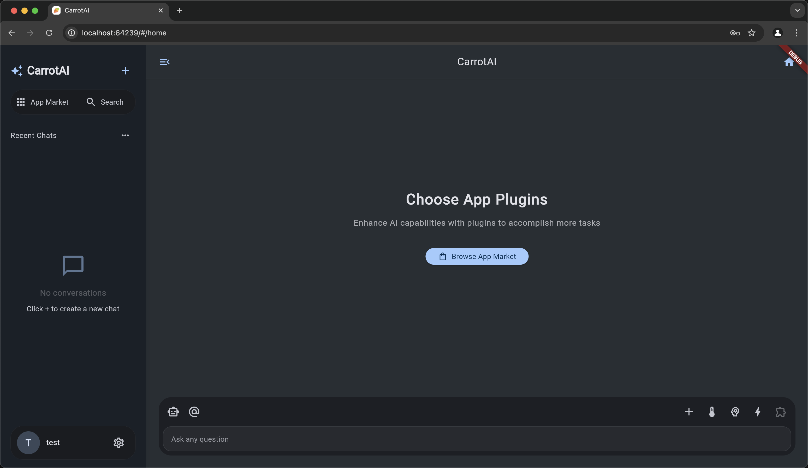

# CarrotAI

<div align="center">
  
  <h3>多语言,支持MCP的 AI Agent</h3>
  <p>Flutter + FastAPI</p>
</div>

<p align="center">
  🚀 <a href="https://chat.jintongshu.com/">在线体验</a>  |  <a href="https://jintongshu.com/download/">SaaS 客户端下载</a>
</p>

---

## 🥕 介绍

CarrotAI 是一个前沿的 AI Agent应用，通过服务器发送事件（SSE）和内置模型控制协议（MCP）集成，实现实时流式聊天。它支持同时连接多个 SSE MCP 服务器，并提供英文、中文和日文的用户界面。

## 🚀 功能

- **AI 代理**：基于 SSE 和 MCP 适配器的实时聊天，带来无缝的对话体验。
- **多服务器支持**：同时连接和调用多个 SSE MCP 服务器，以汇聚智能响应。
- **多语言**：提供完整的英文、中文和日文本地化。
- **深度思考模式**：针对复杂或多步骤查询的高级分析。
- **认证**：使用 JWT 令牌的安全登录/注册流程。
- **响应式 UI**：适配移动端、桌面端和 Web 平台的自适应设计。
- **主题定制**：支持亮/暗模式、自定义主色调，以及通过 `dynamic_color` 实现的动态 Material 3 主题。
- **文件上传**：在对话中附加和解析文件，提供更丰富的上下文。

## 🤖 支持的模型 API

- **DeepSeek**：具备强大推理能力的高级语言模型

## 🛠️ 技术栈

### 前端
- **框架**：Flutter
- **状态管理**：Provider
- **UI**：Material Design 3
- **本地化**：flutter gen-l10n
- **主题**：dynamic_color

### 后端
- **框架**：FastAPI
- **流式**：服务器发送事件（SSE）
- **AI 集成**：DeepSeek LLM，MCP（模型控制协议）
- **数据库**：PostgreSQL + SQLAlchemy
- **身份验证**：JSON Web Tokens
- **迁移**：Alembic
- **部署**：Uvicorn & Gunicorn

## 📋 前置条件

- Flutter SDK ^3.7.2
- Python >=3.12
- PostgreSQL

## ⚡ 快速开始

> 请确保已安装 [uv](https://docs.astral.sh/uv/getting-started/installation/)。

```bash
# 克隆仓库
git clone https://github.com/Xingsandesu/CarrotAI.git && cd CarrotAI

# 处理环境变量
mv backend/.env.example backend/.env && mv .env.example .env

# 编辑环境变量
vim .env
vim backend/.env

# 临时启动 PostgreSQL
docker-compose -f docker-compose.yml -f docker-compose.override.yml up -d postgres

# 后端初始化
uv run backend/scripts/startup.py --user --email <email> --username <name> --password <password>

# 停止 PostgreSQL
docker-compose -f docker-compose.yml -f docker-compose.override.yml down

# 配置文件编辑
vim config/

# 启动后端
docker compose up -d
```

## 🔧 安装

### 后端配置

1. 进入后端目录：
   ```bash
   cd backend
   ```
2. 创建并激活虚拟环境：
   ```bash
   uv sync
   ```
3. 复制示例环境文件：
   ```bash
   cp .env.example .env
   ```
4. 执行数据库迁移：
   ```bash
   uv run scripts/init_db.py && uv run scripts/init_config.py
   ```
5. 启动服务器：
   ```bash
   python main.py       # 开发模式
   python main.py prod  # 生产模式 (Gunicorn)
   ```

### 前端配置

1. 返回项目根目录：
   ```bash
   cd ..
   ```
2. 获取 Flutter 依赖：
   ```bash
   flutter pub get
   ```
3. 生成本地化文件：
   ```bash
   flutter gen-l10n
   ```
4. 运行应用：
   ```bash
   flutter run
   ```
5. 构建 Web 版：
   ```bash
   flutter build web --wasm
   ```

## 🌐 配置

- **前端**：编辑 `lib/core/config/app_config.dart`，设置 API 端点和主题默认值。
- **后端**：在 `.env` 和 `backend/app/core/config.py` 中配置数据库和 MCP 服务器。

### 后端配置文件

后端使用位于 `backend/config/` 的 JSON 文件来定义模型、MCP 服务器和自定义适配器。默认文件结构如下：

```text
backend/config/
├── model_configs.json       # LLM 模型定义和元数据
├── mcp_servers.json         # SSE MCP 服务器端点和环境配置
└── app/                     # 自定义适配器定义
    └── duckduckgo-search.json
```

#### model_configs.json

定义可用的 LLM 模型。每个条目包括：
- `id`（字符串）：模型标识符。
- `icon`（字符串）：显示图标名称。
- `translations`（对象）：本地化名称和描述 (`zh`, `en`, `ja`)。
- `exclusiveRules`（对象）：功能开关和排除规则。

示例：
```json
[
  {
    "id": "deepseek",
    "icon": "smart_toy_outlined",
    "translations": {
      "zh": { "name": "DeepSeek", "description": "专注于深度思考和复杂推理的满血模型" },
      "en": { "name": "DeepSeek", "description": "Powerful Chinese large model focused on deep thinking and complex reasoning" },
      "ja": { "name": "DeepSeek", "description": "深い思考と複雑な推論に特化した強力な中国语大规模モデル" }
    },
    "exclusiveRules": {
      "deepThinking": { "enabled": true, "excludes": ["mcpServices"] },
      "mcpServices": { "enabled": true, "excludes": ["deepThinking"] }
    }
  }
]
```

#### mcp_servers.json

指定 SSE 模型控制协议 (MCP) 端点。格式：
- 键：服务名称。
- `url`（字符串）：SSE 端点 URL。
- `env`（对象）：适配器环境变量。

示例：
```json
{
  "serviceA": {
    "url": "http://localhost:10000/sse",
    "env": {
      "API_KEY": "your_api_key"
    }
  }
}
```

#### 自定义适配器 (`app/*.json`)

将自定义 MCP 适配器放在 `backend/config/app/` 目录。每个文件定义：
- `id`（字符串）：适配器标识符。
- `icon`（字符串）：图标或 emoji。
- `mcpServer`（对象）：与 `mcp_servers.json` 中条目相同的结构。
- `translations`（对象）：本地化 UI 元数据。

示例 (`duckduckgo-search.json`)：
```json
{
  "id": "duckduckgo-search",
  "icon": "🔍",
  "mcpServer": {
    "url": "http://localhost:10000/duckduckgo-search",
    "env": {}
  },
  "translations": {
    "en": { "name": "DuckDuckGo Search", "type": "Search Tool", "description": "Use DuckDuckGo search engine for secure and private web searches" },
    "zh": { "name": "DuckDuckGo搜索", "type": "搜索工具", "description": "使用 DuckDuckGo 搜索引擎进行安全、私密的网络搜索" },
    "ja": { "name": "DuckDuckGo検索", "type": "検索ツール", "description": "DuckDuckGo検索エンジンを使用して安全でプライベートなウェブ検索を行います" }
  }
}
```

#### 使用方法

1. 初始化默认配置：
   ```bash
   uv run scripts/init_config.py
   ```
2. 在 `backend/config/` 目录下修改 JSON 文件，以添加或更新模型和端点。
3. 重启后端服务器以应用更改。

## 🔧 环境变量

**后端 (.env)**

| 键                      | 描述                                 | 默认     |
|-------------------------|--------------------------------------|----------|
| DATABASE_URL            | PostgreSQL 连接 URL                  | *必需*   |
| BACKEND_CORS_ORIGINS    | 允许的 CORS 来源 (逗号分隔)           | []       |
| MCP_SERVERS             | SSE MCP 服务器端点列表 (JSON 格式)   | *必需*   |
| SECRET_KEY              | JWT 密钥                             | *必需*   |

**前端 (lib/core/config/app_config.dart)**
```dart
static String get baseUrl => "http://127.0.0.1:8000";
```

## 💡 使用方法

1. 按"快速开始"中所示启动后端和前端。
2. 在浏览器或移动模拟器中打开应用。
3. 注册或登录以获取 JWT 令牌。
4. 使用深度思考模式或默认聊天模式与 AI 代理交互。
5. 在设置中切换 MCP 服务器或添加新端点。

## 🔗 API 参考

在下面访问交互式 Swagger UI：

```
http://127.0.0.1:8000/docs
```

## 🛣️ 路线图

- [x] SSE 多服务器支持
- [x] 多语言 (EN, 中文, 日本語)
- [x] Docker Compose 支持
- [ ] 本地 Stdio 多服务器支持
- [ ] 本地 OCR 支持
- [ ] 支持更多格式的上传界面
- [ ] 前端自定义提示
- [ ] 支持更多模型
- [ ] 支持更多语言

## 🛡️ 安全

- **认证**：所有后端接口均通过 JWT 保护；令牌安全加密存储。
- **数据保护**：生产环境使用 HTTPS；在 `.env` 中通过 `BACKEND_CORS_ORIGINS` 配置允许的 CORS 来源。
- **密钥管理**：在 `.env` 中定义 `SECRET_KEY`；确保不将密钥提交到源代码。

## 🔍 监控与日志

- **服务器日志**：在 `gunicorn.conf.py` 中配置；访问日志和错误日志位于 `logs/`。
- **应用日志**：使用 Loguru 进行结构化日志；在发布模式下前端禁用 `debugPrint`。

## 🚀 性能与优化

- **缓存**：前端缓存静态资源；后端对 PostgreSQL 使用异步连接池。
- **包体积**：Web 产物通过 `--wasm` 构建，实现优化交付。

## 🗂️ 更新日志

> 所有重要更改均记录在 [CHANGELOG.md](CHANGELOG.md)。

## 📱 截图

<div align="center">
  
  
  
</div>

## 🤝 贡献

欢迎贡献！请提交 Pull Request 并提出您的建议。

## 📄 许可证

本项目遵循 CarrotAI 开源许可证。详情请参见 [LICENSE](LICENSE) 文件。 